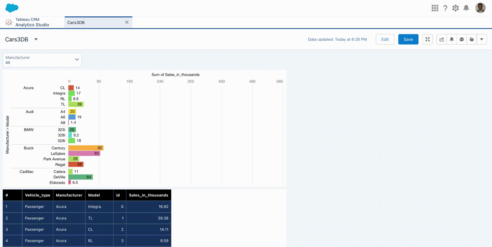

# Visualization experiments on Car Sales Data

## Steps
-  [Data](./cars3.csv) is loaded into TCRM (Tableau CRM) 
```

# Login
sfdx force:auth:web:login

# Load into dataset
sfdx mohanc:ea:dataset:load -u mohan.chinnappan.n_ea2@gmail.com -d cars3.csv

```

-  Create Dashboard based on the created dataset **cars3**
```
sfdx mohanc:ea:dataset:list  -u mohan.chinnappan.n_ea2@gmail.com

Id,Version,Name,Label
0Fb3h000000gTdUCAU,0Fc3h000007WJTeCAO,cars3,cars3


```

## Dashboard 

- [Dashboard json](./dashboard/Cars3DB.json)


## Finding the highest selling Cars (benchmark) from the manufacturers
- 

## Dashboard demos

- 


- 
