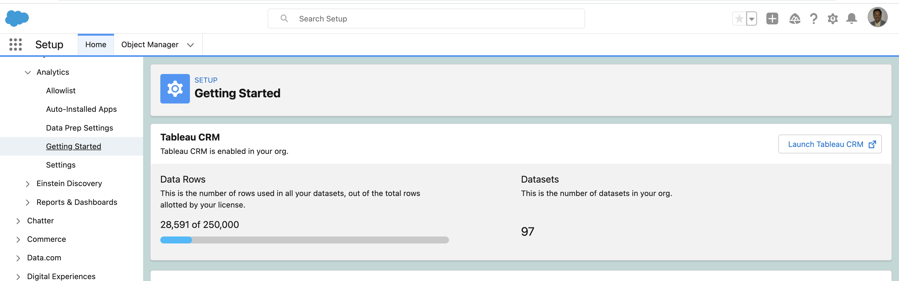

# Add a TCRM User with System admin profile

## Create user
- Use License: Salesforce
- Profile: **System Administrator**
- Make the user **Active**

## Add these Permission sets to the user
| Name      | Description |
| ----------- | ----------- |
|Tableau CRM Plus Admin|enables all permissions required to **administer** the Tableau CRM platform and Einstein Discovery, including permissions to create and manage Tableau CRM templated apps and Apps.|
|Tableau CRM Platform User|Enables all permissions required to **use** the Tableau CRM platform, Einstein Discovery, and Tableau CRM templated apps and Apps.|
|Tableau CRM Platform Admin||
|Tableau CRM Plus User||

## Reset the password to this user

## User Enable Tableau CRM
- User Go to Salesforce Setup and enter Analytics in the Quick Find / Search field.
- Select Getting Started.
- Click Enable Tableau CRM
- Once enabled you will see

## Sharing the TCRM assets

- If you need to share TCRM assets
    - Move your assets from your private folder to shared folder
    

## References
- [Enable Tableau CRM and Create Permission Sets](https://help.salesforce.com/s/articleView?id=sf.bi_setup_enable_create_permset.htm&type=5)

- [Learn About Tableau CRM Platform Licenses and Permission Sets](https://help.salesforce.com/s/articleView?id=sf.bi_help_setup_general.htm&type=5)

- [Learn About Tableau CRM Permission Set Licenses and User Permissions](https://help.salesforce.com/s/articleView?id=sf.bi_setup_user_permissions.htm&type=5)
