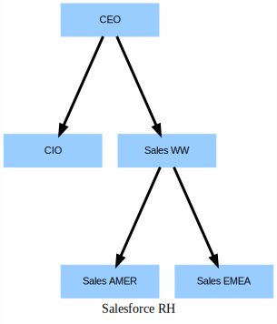

# How to use flatten Transformation to flatten UserRole data

## Visualize Hierarchy 
```
sfdx mohanc:security:rh  -u  mohan.chinnappan.n_ea2@gmail.com
```
```
Writing visualization in file __RH__.svg ...
Visualization done. "open  __RH__.svg" in Chrome Browser to view the Visualization.

```


## Query UserRole

```
cat ~/.soql/userRole.sql 
```
```sql
SELECT
 Id, Name, ParentRoleId
FROM UserRole
```

### Query
```
sfdx mohanc:data:query -q ~/.soql/userRole.sql  -u  mohan.chinnappan.n_ea2@gmail.com 
```


```csv
"attributes","Id","Name","ParentRoleId"
"{""type"":""UserRole"",""url"":""/services/data/v54.0/sobjects/UserRole/00E3h000001JaqUEAS""}","00E3h000001JaqUEAS","CEO",
"{""type"":""UserRole"",""url"":""/services/data/v54.0/sobjects/UserRole/00E3h000001JaqQEAS""}","00E3h000001JaqQEAS","CIO","00E3h000001JaqUEAS"
"{""type"":""UserRole"",""url"":""/services/data/v54.0/sobjects/UserRole/00E3h000001JaqSEAS""}","00E3h000001JaqSEAS","Sales AMER","00E3h000001JaqREAS"
"{""type"":""UserRole"",""url"":""/services/data/v54.0/sobjects/UserRole/00E3h000001JaqTEAS""}","00E3h000001JaqTEAS","Sales EMEA","00E3h000001JaqREAS"
"{""type"":""UserRole"",""url"":""/services/data/v54.0/sobjects/UserRole/00E3h000001JaqREAS""}","00E3h000001JaqREAS","Sales WW","00E3h000001JaqUEAS"
```
- [CSV](./rh.csv)

### JSON
```
sfdx mohanc:data:query -q ~/.soql/userRole.sql  -u  mohan.chinnappan.n_ea2@gmail.com -f json
```

```json
[
    {
        "attributes": {
            "type": "UserRole",
            "url": "/services/data/v54.0/sobjects/UserRole/00E3h000001JaqUEAS"
        },
        "Id": "00E3h000001JaqUEAS",
        "Name": "CEO",
        "ParentRoleId": null
    },
    {
        "attributes": {
            "type": "UserRole",
            "url": "/services/data/v54.0/sobjects/UserRole/00E3h000001JaqQEAS"
        },
        "Id": "00E3h000001JaqQEAS",
        "Name": "CIO",
        "ParentRoleId": "00E3h000001JaqUEAS"
    },
    {
        "attributes": {
            "type": "UserRole",
            "url": "/services/data/v54.0/sobjects/UserRole/00E3h000001JaqSEAS"
        },
        "Id": "00E3h000001JaqSEAS",
        "Name": "Sales AMER",
        "ParentRoleId": "00E3h000001JaqREAS"
    },
    {
        "attributes": {
            "type": "UserRole",
            "url": "/services/data/v54.0/sobjects/UserRole/00E3h000001JaqTEAS"
        },
        "Id": "00E3h000001JaqTEAS",
        "Name": "Sales EMEA",
        "ParentRoleId": "00E3h000001JaqREAS"
    },
    {
        "attributes": {
            "type": "UserRole",
            "url": "/services/data/v54.0/sobjects/UserRole/00E3h000001JaqREAS"
        },
        "Id": "00E3h000001JaqREAS",
        "Name": "Sales WW",
        "ParentRoleId": "00E3h000001JaqUEAS"
    }
]
```

## Create a Recipe to show the flatten transformation


