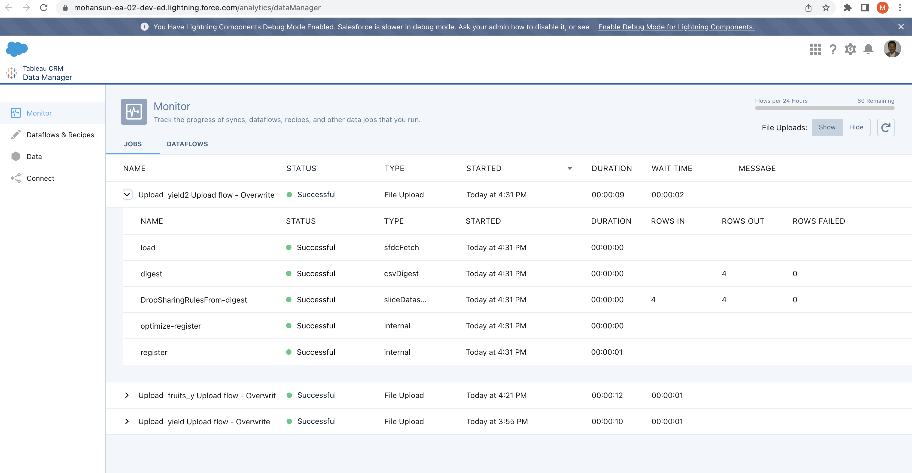
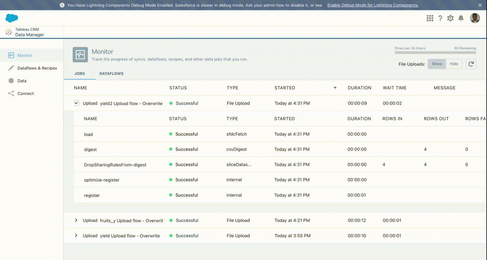

# Security Predicate Simple Example

## Use case
- Assume we like to create an external data based dataset  ```yield2``` created out of this csv file:
- Restrict the logged in user can see only records with ```user_name``` as logger user name ```User.Name```
- Use Security Predicate to implement this


```
cat yield2.csv 
user_name,friut,qty
Dennis Ritchie,Jackfruit,200
Ken Thompson,Peach,400
Niklaus Wirth,Pear,200
Mohan Chinnappan,Mango,100
```

## Load this csv into dataset ```yield2```

### Login into the org
```
sfdx force:auth:web:login                                                   
Successfully authorized mohan.chinnappan.n_ea2@gmail.com with org ID 00D3h000007R1LuEAK
```

### Load csv into dataset - yield
```
mchinnappan@mchinnappan-ltm fruits % sfdx mohanc:ea:dataset:load -u mohan.chinnappan.n_ea2@gmail.com -d yield2.csv 
```

```
=== Sampling data
-- Please make sure that first row of your data does not have missing values --
[
  [ 'user_name', 'friut', 'qty' ],
  [ 'Dennis Ritchie', 'Jackfruit', '200' ]
]
=== Finding the data types based on the sample data ...
[
  {
    fullyQualifiedName: 'yield2.user_name',
    label: 'user_name',
    name: 'user_name',
    isSystemField: false,
    isUniqueId: false,
    isMultiValue: false,
    multiValueSeparator: 'null',
    type: 'Text'
  },
  {
    fullyQualifiedName: 'yield2.friut',
    label: 'friut',
    name: 'friut',
    isSystemField: false,
    isUniqueId: false,
    isMultiValue: false,
    multiValueSeparator: 'null',
    type: 'Text'
  },
  {
    fullyQualifiedName: 'yield2.qty',
    label: 'qty',
    name: 'qty',
    isSystemField: false,
    isUniqueId: false,
    type: 'Numeric',
    defaultValue: '0',
    precision: 18,
    scale: 0
  }
]
=== Preparing for the loading ...
{ id: '06V3h000000ieaBEAQ', success: true, errors: [] }
-- Maximum Chunck size: 9437184 bytes --
=== Loading part: '1' with chunk size: 164 bytes ...
{ id: '06W3h000000edBmEAI', success: true, errors: [] }
=== Loading Complete.
Going to process...

Done.
Time taken: 10.242 seconds
open https://mohansun-ea-02-dev-ed.my.salesforce.com/analytics/dataManager in a web browser to view this job

```

### Dataset yield2
- 

### Demo to show Security Predicate in action
```
'user_name' == "$User.Name"
```

- 


