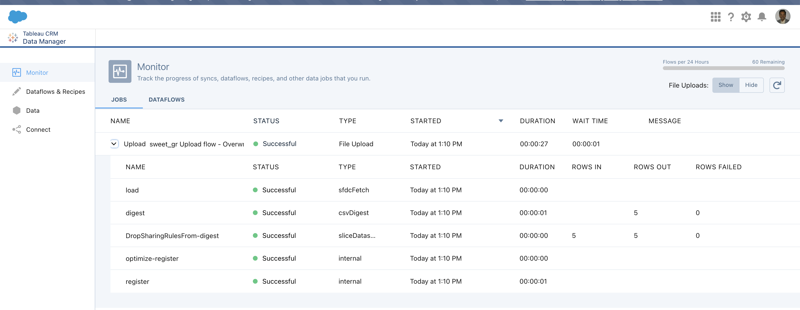
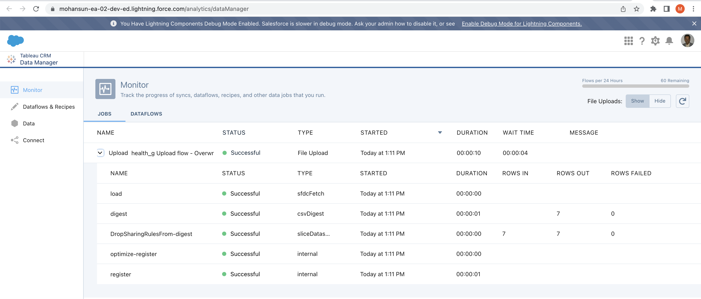

# Using JOINS in Recipes

## Login
```
sfdx force:auth:web:login
Successfully authorized mohan.chinnappan.n_ea2@gmail.com with org ID 00D3h000007R1LuEAK


```
## Sweet Grade Load
```
sfdx mohanc:ea:dataset:load -u mohan.chinnappan.n_ea2@gmail.com -d sweet_grade.csv
=== Sampling data
-- Please make sure that first row of your data does not have missing values --
[ [ 'name', 'score' ], [ 'Mango', '4' ] ]
=== Finding the data types based on the sample data ...
[
  {
    fullyQualifiedName: 'sweet_gr.name',
    label: 'name',
    name: 'name',
    isSystemField: false,
    isUniqueId: false,
    isMultiValue: false,
    multiValueSeparator: 'null',
    type: 'Text'
  },
  {
    fullyQualifiedName: 'sweet_gr.score',
    label: 'score',
    name: 'score',
    isSystemField: false,
    isUniqueId: false,
    type: 'Numeric',
    defaultValue: '0',
    precision: 18,
    scale: 0
  }
]
=== Preparing for the loading ...
{ id: '06V3h000000ieqYEAQ', success: true, errors: [] }
-- Maximum Chunck size: 9437184 bytes --
=== Loading part: '1' with chunk size: 72 bytes ...
{ id: '06W3h000000edSEEAY', success: true, errors: [] }
=== Loading Complete.
Going to process...

Done.
Time taken: 10.290 seconds
open https://mohansun-ea-02-dev-ed.my.salesforce.com/analytics/dataManager in a web browser to view this job

```



## Health Grade Load
```
sfdx mohanc:ea:dataset:load -u mohan.chinnappan.n_ea2@gmail.com -d health_grade.csv
=== Sampling data
-- Please make sure that first row of your data does not have missing values --
[ [ 'name', 'score' ], [ 'Mango', '5' ] ]
=== Finding the data types based on the sample data ...
[
  {
    fullyQualifiedName: 'health_g.name',
    label: 'name',
    name: 'name',
    isSystemField: false,
    isUniqueId: false,
    isMultiValue: false,
    multiValueSeparator: 'null',
    type: 'Text'
  },
  {
    fullyQualifiedName: 'health_g.score',
    label: 'score',
    name: 'score',
    isSystemField: false,
    isUniqueId: false,
    type: 'Numeric',
    defaultValue: '0',
    precision: 18,
    scale: 0
  }
]
=== Preparing for the loading ...
{ id: '06V3h000000ieqdEAA', success: true, errors: [] }
-- Maximum Chunck size: 9437184 bytes --
=== Loading part: '1' with chunk size: 96 bytes ...
{ id: '06W3h000000edSJEAY', success: true, errors: [] }
=== Loading Complete.
Going to process...

Done.
Time taken: 40.003 seconds
open https://mohansun-ea-02-dev-ed.my.salesforce.com/analytics/dataManager in a web browser to view this job

```

- 
